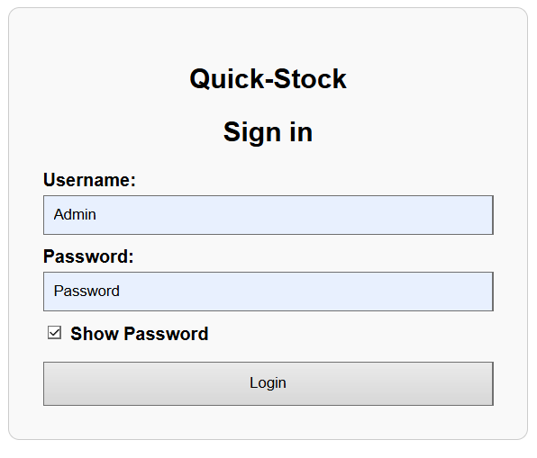

# QuickStock-Rust

# Designed to Run on Visual Studio Code (VS Code)

This project is for CS4340 - Software Maintenance at UCCS. We chose to change an open source github project from Python to Rust and we also implemented the frontend using React.


## Dependencies
Must have Rust downloaded, all other dependancies should be installed when running the program. To see all dependencies for this app, consult the cargo.toml file.

**Download Rust here** (either 32 or 64 bit versions should work): https://www.rust-lang.org/tools/install

Use the default installation for this app.

After installation, restart your IDE (we are using VScode). Then move on to the run instructions.

## Preferred Running Method
After installing the app and the dependant files, navigate to the git bash for this project on your computer.
If it is your first time running the app on your machiene, run the command:
```
chmod +x start.sh
```

After that, or if you have used the app before, run the following command to start thhe app:
```
./start.sh
```
If this does not work, proceed to run the backend and fontend independantly of eachother.

To terminate the program terminate the process in the terminal (ctrl + C).


### Run Backend Instructions
To compose the proram on your machiene, go to the terminal and execute these commands:
```
cargo build
```
```
cargo run
```

To terminate the program terminate the process in the terminal (ctrl + C).


### Run Frontend Instructions
Firstly, make sure you have Node.js installed. You can check this by executing the following command in your terminal:
```
node -v
```
If Node.js is not installed, you can install it at https://nodejs.org/en.

Execute the following commands to install dependencies:
```
npm install dayjs
npm install react-router-dom
npm install @mui/x-charts@next
npm install @mui/material @emotion/react @emotion/styled
```

Open a terminal and change the directory to the "Frontend" folder (The path should be C:\...\QuickStock-Rust\Frontend) in the QuickStock-Rust project folder. Execute the following command:
```
npm start
```
If the window does not automatically navigate to your localhost, enter "http://localhost:3000/" into your browser of choice.

To terminate the program terminate the process in the terminal (ctrl + C).

**If you encounter the following error:**
"Invalid options object. Dev Server has been initialized using an options object that does not match the API schema.
options.allowedHosts[0] should be a non-empty string."

Create a new file named ".env" in the Frontend folder and paste the following code into the file:
```
DANGEROUSLY_DISABLE_HOST_CHECK=true
```

## Once You Have the App Running...
You should see a login page:


The default credientails are:
Username: Admin
Password: Password

These credentials can be changes in the settings.

If you would like to add information to your data, use the "Add Item" button. If you would like to view/edit/delete things from your data, use the "Display Inventory"  button. 
The "Sales" Button will display your data in multiple graphs. "Record Sale" will allow you to record new sales for an item. 
## Other Documentation
This is some other documentation that we found useful for this project:

**Rust documentation:** https://doc.rust-lang.org/stable/

**React documentation:** https://www.google.com/search?client=opera-gx&q=react+dosumentation&sourceid=opera&ie=UTF-8&oe=UTF-8

## Original Project
Here is the original project: https://github.com/Hamilton-Davis/Inventory-Intro-to-Software-Dev


## Running Tests

This project includes a complete suite of unit and integration tests to verify backend functionality, including:

- Login authentication
- Product database operations
- HTTP endpoint responses

All tests are designed to run in **isolation** using **in-memory SQLite databases**, ensuring that no real data is modified or required.

###  Test Types

| File                     | Description                                                        |
|--------------------------|--------------------------------------------------------------------|
| `tests/integration_tests.rs` | Tests API endpoints such as `/health` and `/products`               |
| `tests/db_tests.rs`           | Tests inserting and retrieving products in a temporary SQLite database |
| `tests/auth_tests.rs`         | Tests login logic for valid, invalid, and unknown users              |

### 🔧 Requirements

Before running tests, ensure:
- Rust is installed (`cargo` command available)
- You are in the project root (where `Cargo.toml` is located)

No actual `.db` files are required to run the tests.

###  Run All Tests

Run the following command in your terminal:

```bash
cargo test
```

This command will compile the code and run all tests across the project.

###  Sample Output

```
PS C:\Users\hddav\OneDrive\Documents\GitHub\QuickStock-Rust\QuickStock-Rust> cargo test
>>
    Finished `test` profile [unoptimized + debuginfo] target(s) in 0.46s
     Running unittests src\lib.rs (target\debug\deps\quickstock_rust-a2d87785c88fc943.exe)

running 0 tests

test result: ok. 0 passed; 0 failed; 0 ignored; 0 measured; 0 filtered out; finished in 0.00s

     Running unittests src\main.rs (target\debug\deps\quickstock_rust-8c822fe7e3a3b660.exe)

running 0 tests

test result: ok. 0 passed; 0 failed; 0 ignored; 0 measured; 0 filtered out; finished in 0.00s

     Running tests\auth_tests.rs (target\debug\deps\auth_tests-373a8a505946a56a.exe)

running 3 tests
test test_unknown_user ... ok
test test_invalid_password ... ok
test test_valid_login ... ok

test result: ok. 3 passed; 0 failed; 0 ignored; 0 measured; 0 filtered out; finished in 0.02s

     Running tests\db_tests.rs (target\debug\deps\db_tests-70942550cb9aa477.exe)

running 1 test
test test_user_db_insert_and_query ... ok

test result: ok. 1 passed; 0 failed; 0 ignored; 0 measured; 0 filtered out; finished in 0.00s

     Running tests\integration_tests.rs (target\debug\deps\integration_tests-0c15eb370567a0a7.exe)

running 2 tests
test test_products_endpoint ... ok
test test_health_check_endpoint ... ok

test result: ok. 2 passed; 0 failed; 0 ignored; 0 measured; 0 filtered out; finished in 0.00s

   Doc-tests quickstock_rust

running 0 tests

test result: ok. 0 passed; 0 failed; 0 ignored; 0 measured; 0 filtered out; finished in 0.00s
```

Each test is fast and reliable, making it easy to validate core logic before committing changes or releasing new builds.
